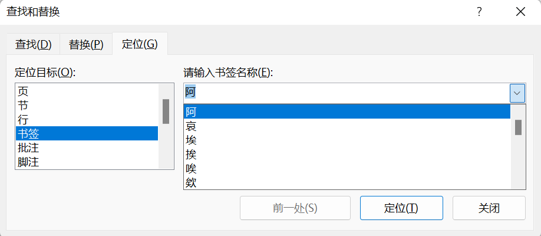

# shuowen

#### 介绍
说文段注WORD版（LTSC）

#### 字体（必装）

[宋体-方正超大字符集](./Fonts/宋体-方正超大字符集.TTF)

[方正字迹-顧建平篆書 繁U](./Fonts/方正字迹-顧建平篆書%20繁U.TTF)

[北师大说文小篆](./Fonts/北师大说文小篆.ttf)

#### 事项记铨

* 点校格式：

  * 标注
    * （经）：代表许慎经学思想的字，如：䍿
    * （隶古定）：壁中古文隶定字，如：𤾊
    * （尚）：上古氏族部落字，本义隐秘，如：灋。
    * （⚙️）：不见于文献，刻意离析出来的部件字，如：叒。
    * （🐘）：象形字，如：山。
    * （🔴）：最原始的义轨，如：八。
    * （📖）：非三言两语能讲清楚的，具有文化意义上的字，如玉石文化、天干地支。
    * （😵‍💫）：段注说解难度非常大的字，需要系联七八个，甚至十个以上的字，如：轖。
    * （大徐补）：大徐所补一十九文字，如：璵
    * （新）：大徐新附字，如：禰
    * （应删）：段玉裁所校理应删除字，如：瑳
    * （应补）：段玉裁所校理应增补字，如：䑁
    * （调序）：段玉裁所校次序颠倒字，如：璬、珩、玦

  * 颜色
    * 朱红：说文原文

    * 绿字：切音

    * 绿字斜体：系联文字切音

    * 注文红字：系联文字

    * 蓝字斜体：引文
  * 符号
    * 波浪线：书名
    * 下划横线：人名、少量地名
    * 双下划横线：章节名（绝大部分）
    * 方括号 **[]**：补录文字，非书中原文

* 旁注格式：
  * 发：嬉皮文字
  * 疏：疏通词句
  * 笺：笺识作者意
  * 赞：举称作者才

* 按语：作框以见区分

* 快捷键：

  * 书签：`Ctrl + G`

    

  * 返回最近位置：`Shift + F5`

* 文件打开慢、保存慢，几度崩溃：

  * 升级office2021：[Office 2021 安装激活教程](https://www.bilibili.com/read/cv11733923)
  * 将WORD分卷：[Word 主控文档与子文档](https://www.bilibili.com/video/BV1cT4y1g716?share_source=copy_web)
  * 换新电脑

* 番外资源：
  * [說文解字（Mdict版）](https://forum.freemdict.com/t/topic/9351)，字典之精，无出其右
    * [《故训汇纂》](https://forum.freemdict.com/t/topic/11957)，亦可採备
  * [数字化《说文解字》](http://szsw.bnu.edu.cn/),说文四大家，汇集于斯
  * [古籍检索系统](https://www.shidianguji.com/)，文信可征
  * [汉字全息资源应用系统](https://qxk.bnu.edu.cn/)，可供校勘
  * [《新撰字镜》、《篆隶万象名义》检索系统](https://github.com/shikeda/HDIC)，可供校勘
  * [《切韵》残卷检索系统](https://suzukish.sakura.ne.jp/search/qieyun/index.php)，可供校勘
  * [知网论文下载](http://b.r88r.top/)，聊备一说
  
* 原数据来源：
  * https://github.com/shuowenjiezi/shuowen

